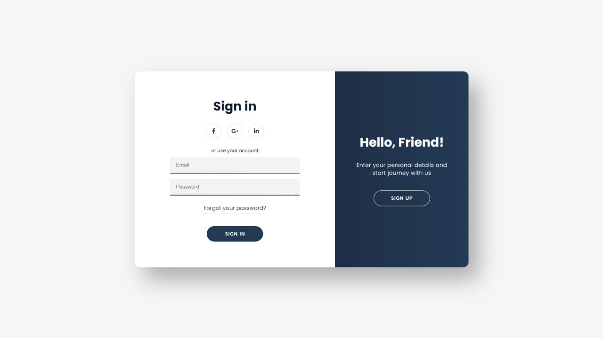

# Frontend-RegisterPage-HTML-CSS-BOOTSTRAP-JavaScript-Tutorials
My_Frontend || RegisterPage-HTML-CSS-BOOTSTRAP-JavaScript || 3 - Tutorial

## Screenshots
<table>
    <tr>
        <td>
            
        </td>
    </tr>
</table>

## Demo

[Live Demo](https://sign-up-tutorial-3.netlify.app)

## Tech Stack

- HTML
- CSS
- JavaScript

## Authors

- [T.Oqilbek](https://www.github.com/tolqinov-o)

### My RegisterPage Demo Link

```
https://sign-up-tutorial-3.netlify.app
```